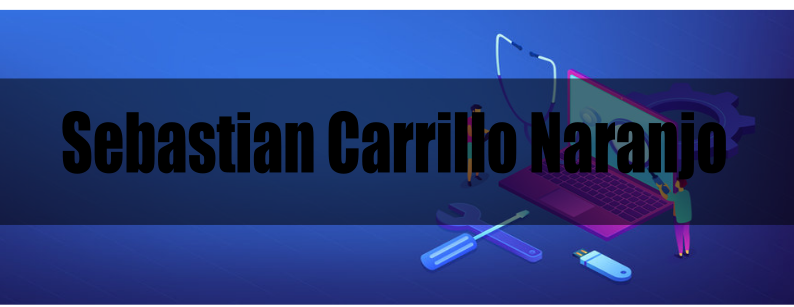

# 👋 Hola, Bienvenido a mi perfil

## 🎓 Sebastiasn carrillo 
**Estudiante**

Soy estudiante de Ingeniería de Sistemas, apasionado por el desarrollo y la gestión de proyectos en entornos web y móvil. Me especializo en backend y desarrollo full-stack, trabajando con tecnologías modernas y metodologías ágiles.

### ✨ Frase que me inspira:
> "Cada línea de código que escribo es un paso más hacia el futuro que quiero construir"

---

## 🚀 Tecnologías que más uso:
`HTML` `CSS` `JavaScript` `React` `Node.js` `PHP` `MySQL` `MongoDB` `Python` `Git` `Docker`

## 🛠 Otras tecnologías que conozco:
`Java` `Spring Boot` `C#` `Angular` `Vue.js` `TypeScript` `PostgreSQL` `Firebase` `Kotlin`

---

## 🎓 Dónde estudio:
- 🏫 **Universidad de Manizales**
!(universidad_manizales.png)

---

## 📫 ¡Conéctate conmigo!
- 📧 **Correo:** [cn.sebas05@gmail.com](cn.sebas05@gmail.com)
- 💼 **LinkedIn:** [linkedin.com/in/tuusuario]()

